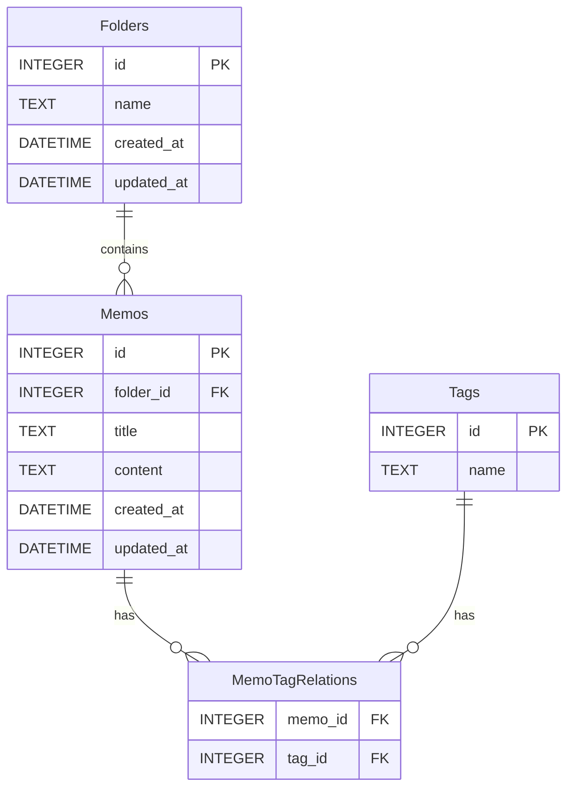

# データベーススキーマ

## 使用するデータベース

SQLite

## テーブル

### Folders

フォルダを管理するテーブル

| カラム名   | データ型 | 制約                      | 説明                 |
| ---------- | -------- | ------------------------- | -------------------- |
| id         | INTEGER  | PRIMARY KEY               | フォルダの一意識別子 |
| name       | TEXT     | NOT NULL                  | フォルダの名前       |
| created_at | DATETIME | DEFAULT CURRENT_TIMESTAMP | 作成日時             |
| updated_at | DATETIME | DEFAULT CURRENT_TIMESTAMP | 最終更新日時         |

### Memos

メモを管理するテーブル

| カラム名   | データ型 | 制約                                                 | 説明                     |
| ---------- | -------- | ---------------------------------------------------- | ------------------------ |
| id         | INTEGER  | PRIMARY KEY                                          | メモの一意識別子         |
| folder_id  | INTEGER  | FOREIGN KEY REFERENCES Folders(id) ON DELETE CASCADE | フォルダのID             |
| title      | TEXT     | NOT NULL                                             | メモのタイトル           |
| content    | TEXT     | NOT NULL                                             | メモのMarkdownコンテンツ |
| created_at | DATETIME | DEFAULT CURRENT_TIMESTAMP                            | 作成日時                 |
| updated_at | DATETIME | DEFAULT CURRENT_TIMESTAMP                            | 最終更新日時             |

### Tags

タグを管理するテーブル

| カラム名 | データ型 | 制約             | 説明             |
| -------- | -------- | ---------------- | ---------------- |
| id       | INTEGER  | PRIMARY KEY      | タグの一意識別子 |
| name     | TEXT     | NOT NULL, UNIQUE | タグの名前       |

### MemoTagRelations

メモとタグのリレーションを管理するテーブル

| カラム名 | データ型 | 制約                                               | 説明     |
| -------- | -------- | -------------------------------------------------- | -------- |
| memo_id  | INTEGER  | FOREIGN KEY REFERENCES Memos(id) ON DELETE CASCADE | メモのID |
| tag_id   | INTEGER  | FOREIGN KEY REFERENCES Tags(id) ON DELETE CASCADE  | タグのID |

## ER Diagram

